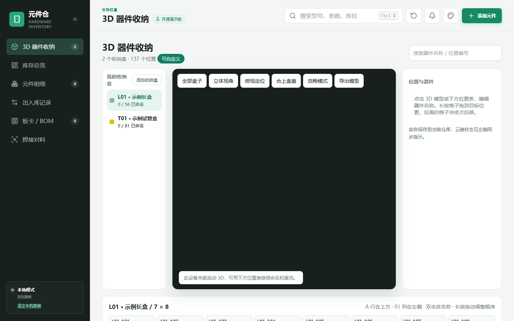
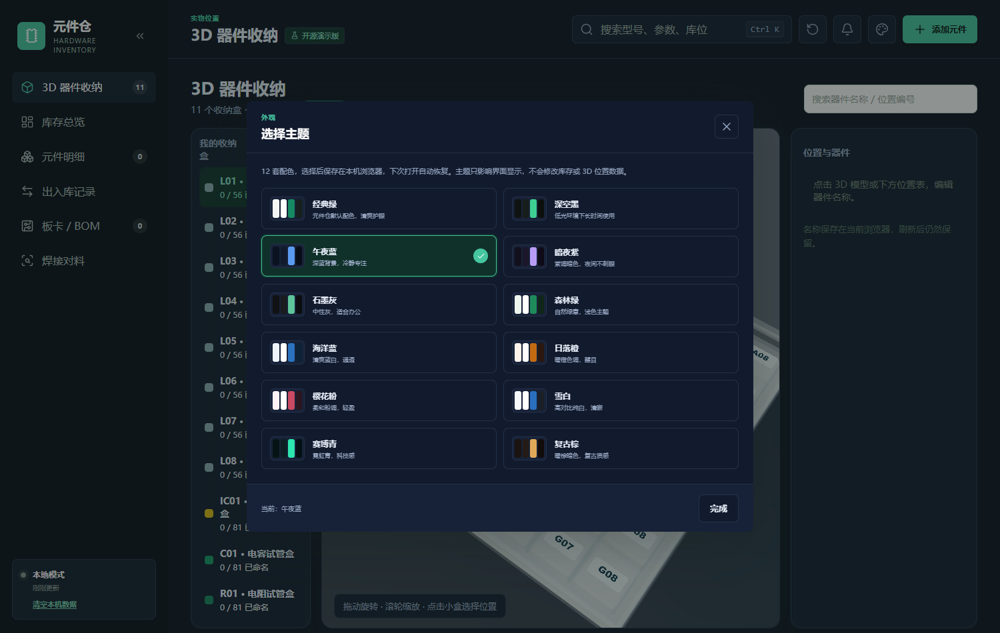
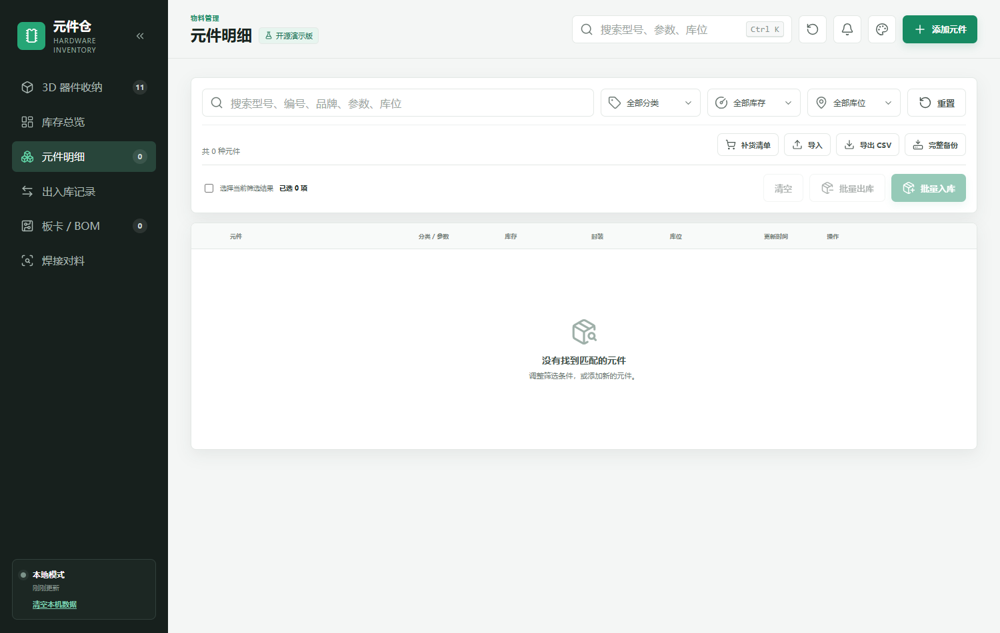

# 元件仓 · 开源演示版

> Hardware Inventory Demo — 本地电子元器件库存管理。  
> 含库存总览、元件明细、出入库、3D 器件收纳、BOM 导入、Gerber 焊接对料和 12 套主题。数据保存在当前浏览器。





---

## 这是什么

这是开源的本地演示版，打开就能用：

- **库存总览**：元件种类、库存总量、低库存、库位统计、分类占比、最近操作。
- **元件明细**：搜索、分类/库存/库位筛选、单个/批量出入库、收藏、CSV/JSON 导入导出、补货清单。
- **出入库记录**：入库/出库流水、筛选、统计。
- **板卡 / BOM**：导入 XLSX / XLS / CSV BOM，自动拆分被动器件，匹配库存，确认后本地扣减并保存板卡领料记录。
- **焊接对料**：打开 Gerber ZIP，加载 BOM 和坐标，点击器件在板上点亮焊盘，板卡可保存在本机。
- **3D 器件收纳**：默认 **1 个长收纳盒（L01）+ 1 个黄色正方形试管盒（T01）**，格子可长按拖动换位、双击改名、关联库存器件；可自行添加更多盒子。
- **扫码**：嘉立创标签二维码本地解析，支持摄像头和 USB 扫码枪；不联网。
- **12 套主题**：经典绿、深空黑、午夜蓝、暗夜紫、石墨灰、森林绿、海洋蓝、日落橙、樱花粉、雪白、赛博青、复古棕。

---

## 快速开始

### 方式一：本地静态服务器（推荐）

```bash
npm install
npm run serve
# 打开 http://127.0.0.1:4173
```

也可以使用任意静态服务器，例如：

```bash
npx serve public
# 或
python -m http.server 4173 --directory public
```

### 方式二：直接打开

`public/index.html` 是纯静态页面。由于浏览器对 `file://` 下的模块加载有限制，建议用上面的静态服务器方式。

### GitHub Pages

仓库自带 `.github/workflows/pages.yml`。把代码推到 GitHub 的 `main` 分支后：

1. 打开仓库 **Settings → Pages**；
2. Source 选择 **GitHub Actions**；
3. 等待 Actions 完成，即可通过 `https://<用户名>.github.io/<仓库名>/` 访问。

页面里的资源路径都是相对路径，放在子目录下也能正常加载。

---

## 精细操作教程

按按钮名称一步一步点。数据只保存在当前浏览器。默认空仓库，3D 只有 **L01 示例长盒** 和 **T01 黄色试管盒**。

### 1. 打开页面

1. `npm run serve` 后用 Chrome 或 Edge 打开 `http://127.0.0.1:4173`，或打开 GitHub Pages 演示地址。
2. 左下角应显示 **本地模式**。
3. 顶栏有「清空本机数据」：会删掉当前浏览器里的库存和 3D 命名，不影响别人。

### 2. 库存总览

左侧：3D 器件收纳、库存总览、元件明细、出入库记录、板卡/BOM、焊接对料。

四个卡片都能点：元件种类、库存总量、低库存、已用库位。

中间快捷操作：**元件入库 / 元件出库 / 扫码入库 / 补货清单**。

### 3. 添加元件

1. 点右上角绿色 **添加元件**。
2. 型号、分类必填。
3. **当前库存可以留空** = 数量未知。留空不计入库存总量，也不会当成缺货。
4. 立创搜索需要自行配置接口；未配置时可手动填分类、品牌、封装、参数。
5. 保存后到 **元件明细** 确认。

### 4. 扫码入库（连续扫）

1. 总览点 **扫码入库**。
2. 点 **开启摄像头扫描**，允许浏览器使用摄像头。
3. 嘉立创袋子二维码对准框。反光就斜一点。
4. 也可用 USB 扫码枪，或把二维码内容粘贴后点 **解析**。
5. 核对名称（应是 `100nF 0603 50V` 这种规格）。
6. 点保存。**扫码窗口应还在**，继续扫下一袋。相同码 5 秒内不会重复入库。
7. 若保存后跳回总览：先 **Ctrl + F5**。

### 5. 元件明细、出入库、补货

- 搜索：顶栏 **Ctrl + K**，或明细页搜索框。
- 出库：库存不够会拦住。数量未知的不能直接出库，先填库存或先入库。
- 批量：勾选后整批入库/出库。
- 补货清单：低于预警的待采购列表。数量未知的不计入缺货。

### 6. 三维器件收纳

默认两个盒子：**L01 示例长盒**、**T01 黄色试管盒**。可点「添加收纳盒」再加。

1. 拖动旋转，滚轮缩放。若 3D 画不出来，仍可用下方格子表改名。
2. 点格子，右侧填名称，点 **保存此位置**。可关联库存器件（不改数量）。
3. 编号：`L01-C01` = L01 盒、C 行、第 1 列。双击格子也可改名。

**长按拖动换位：**

1. 按住下方表格里的格子：**立刻变黄、放大**，底部黄条往前走。
2. 约半秒后出现「拖动换位」卡片，再拖。
3. 拖到目标格（出黄框）松开。该格及后面的格子依次后移。
4. **格子编号不变**，变的是里面的器件名称。
5. 单击是选中，双击是改名。不要一按就松。

### 7. 嘉立创导出 BOM

1. 嘉立创 EDA：**文件 → 导出 → 物料清单(BOM)…**
2. 文件类型 **XLSX**。
3. 列必须有：Comment（备注）、Designator（位号）、Footprint（封装）、Manufacturer Part（制造商编号）。
4. 位号、封装的「分组」选 **是**。
5. 点 **导出BOM**。到本页 **板卡 / BOM** 点 **导入板卡 BOM**。

### 8. 嘉立创导出 Gerber

1. **文件 → 导出 → PCB制板文件(Gerber)…**
2. 文件名只用英文或数字，例如 `Gerber_PCB1_2026-09-09`。
3. 选项选 **一键导出**，不要勾彩色丝印。
4. 点 **导出Gerber**，得到 ZIP。
5. 要点亮焊盘：同一菜单再导出 **坐标文件(CPL)** 或 **飞针测试文件**。
6. 一键 ZIP **一般不含 BOM**，要单独导出。

### 9. 焊接对料

1. 点 **打开 Gerber ZIP**。右侧出现板图。
2. 点 **加载 BOM**。左侧出现器件。点一行，板上焊盘会亮。
3. 导错了：
   - **清除 BOM**：板图还在。
   - **关闭 Gerber**：BOM 还在。
   - **清空当前**：三者都清。已保存板卡不会删。
4. **不要**随手点「确认领料并扣库存」，那会真的减数量。

### 10. 出了问题

| 现象 | 做法 |
| --- | --- |
| 保存元件后跳回总览 | Ctrl + F5 |
| 摄像头扫不出 | 允许摄像头；反光斜一点；改用扫码枪 |
| 长按格子没反应 | 按住等到变黄再拖 |
| 数据不见了 | 数据只在当前浏览器；清缓存或换设备后不会带过来 |
| 想重来 | 点「清空本机数据」 |

更完整的逐步说明见 [docs/tutorial.md](docs/tutorial.md)。

---

## 初始数据与本地存储

- 默认是**空仓库**：不包含任何真实库存，也不预置演示元件；首次打开所有统计为 0。
- 访问者可以自己添加元件、导入 BOM、编辑 3D 位置；所有数据只保存在当前浏览器 `localStorage`。
- 顶栏的「清空本机数据」按钮可以一键删除当前浏览器里的本地数据。
- 换浏览器、换设备或清除浏览器数据后，数据不会自动同步。

本地存储键：

| 键 | 用途 |
| --- | --- |
| `component-vault-open-source-data-v2` | 元件、流水、板卡、3D 位置、收纳盒 |
| `component-vault-theme` | 当前主题 |
| `component-vault-theme-mode` | 当前主题明暗模式 |
| `component-vault-sidebar-collapsed` | 侧栏收缩状态 |



---

## 目录结构

```
.
├── public/                      # 静态站点根目录
│   ├── index.html               # 页面结构、侧栏、弹窗
│   ├── app.js                   # 库存 / BOM / 焊接 / 扫码 / 3D Bridge
│   ├── styles.css               # 主样式、侧栏、12 套主题
│   ├── theme.js                 # 主题定义与切换
│   ├── config.js                # 开源演示版配置（云端/立创均关闭）
│   ├── bom-manager.js           # BOM 解析、被动器件拆分与匹配
│   ├── pickplace-manager.js     # 坐标文件解析
│   ├── gerber-session.js        # Gerber 会话
│   ├── solder-board-store.js    # 本机板卡保存
│   ├── qr-decoder.js            # 嘉立创标签字段解析
│   ├── jsQR.min.js              # 二维码识别（本地）
│   ├── jszip.min.js             # Gerber ZIP 解压
│   ├── pcb-stackup.min.js       # Gerber 渲染
│   ├── xlsx.full.min.js         # BOM / CSV 读取
│   ├── lucide.min.js            # 图标
│   └── storage3d/               # 3D 器件收纳
│       ├── main.js              # 3D 交互源码
│       ├── model.js             # 盒子编号与自定义盒子规则
│       ├── storage.css          # 3D 页样式
│       └── bundle.js            # 已打包的 3D 模块
├── docs/
│   ├── screenshot.png           # README 预览图
│   ├── tutorial.md              # 精细操作教程（完整版）
│   └── ...
├── scripts/serve.cjs            # 本地静态服务器
├── licenses/                    # 第三方许可证文本
├── THIRD_PARTY_NOTICES.md       # 第三方组件说明
└── package.json
```

---

## 开发与构建

3D 收纳的源码在 `public/storage3d/main.js`，使用 esbuild 打包成 `public/storage3d/bundle.js`：

```bash
npm run build
```

修改 `main.js` 或 `model.js` 后必须重新构建，否则页面加载的仍是旧的 `bundle.js`。

页面本身不需要构建；改 `public/` 下的 HTML/CSS/JS 后刷新即可。

---

## 立创搜索（可选）

演示版默认只手动填写元件字段。若要按型号或 C 编号搜索，在 `public/config.js` 里把 `LCSC_LOOKUP.apiBase` 指到你自己的同源 `/api/lcsc` 即可。

---

## 本版更新

- 3D 默认是 **1 个长盒 + 1 个黄色正方形试管盒**。
- 格子支持长按拖动换位。
- 焊接对料可清除 BOM / 关闭 Gerber，并附嘉立创导出格式说明。
- 库存数量可留空表示未知。
- 默认空仓库；自己添加的数据只保存在本机浏览器。

---

## 已知限制

- 默认是空仓库，需要自己添加元件或导入 BOM 才能看到库存数据。
- 数据只保存在当前浏览器，不跨设备、不跨浏览器同步。
- 3D 模型是程序生成的展示模型，没有毫米级尺寸标定，不能用于加工。
- BOM 中同一行包含多个阻值/容值时，系统会拆分并匹配，但不会猜测每种值的实际数量；数量需要人工确认后才会扣库存。
- 立创搜索需要自行配置接口。
- 适合本地演示和二次开发。

---

## 第三方组件

本仓库使用了 Lucide、SheetJS、JSZip、pcb-stackup、jsQR、three.js、esbuild 等第三方组件，许可证和来源见 [THIRD_PARTY_NOTICES.md](THIRD_PARTY_NOTICES.md) 和 `licenses/` 目录。

---

## 许可证

本项目以 [MIT License](LICENSE) 开源。第三方组件仍遵循各自的许可证。
